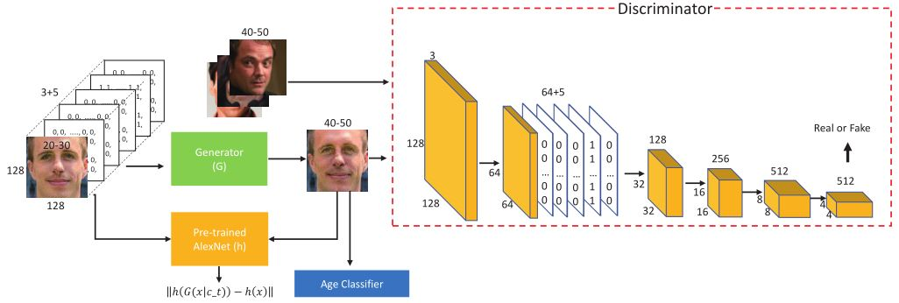

# Face Aging using Identity-Preserved Conditional Generative Adversarial Networks 
Age conditional GAN (Age-cGAN) is a GAN-based method for automatic face aging. It was the first GAN to generate high quality synthetic images within required age categories. 
Eventually, a novel latent vector optimization approach called Identity-Preserved Conditional GAN (IPCGAN) was proposed which allowed Age-cGAN to reconstruct an input face image while preserving the original person’s identity.

## Problem Statement
Face aging is of great importance for cross-age recognition and entertainment related applications. However,the lack of labeled faces of the same person across a longage range makes it challenging. Because of different aging speed of different persons, this face aging approach aims at synthesizing a face whose target age lies in some given age group instead of synthesizing a face with a certain age. By grouping faces with target age together, the objective offace aging is equivalent to transferring aging patterns of faces within the target age group to the face whose aged face is to be synthesized. Meanwhile, the synthesized faceshould have the same identity with the input face. 

## Input and Output
The input to the model is an image (from 'images/test') and the output from the model (in 'age/0_conv5_lsgan_transfer_g75_0.5f-4_a30/') is a set of 5 images where one of them is the input image and the other four are aged faces with class labels: 21-30, 31-40, 41-50 and 50+. The target age here is 50+.

This repository gives detailed step-by-step instructions on how to obtain aged faces using IPCGAN, as well as validating the performance of the model through face recognition (using DeepFace), which is a well known application of face aging.


## Dataset
A subset of the Cross-Age Celebrity Dataset is used for training and Evaluation. 
After face detection, aligning and center cropping, the images are split into 5 age groups: 11-20, 21-30, 31-40, 41-50 and 50+.
For more details about this dataset, please refer to (http://bcsiriuschen.github.io/CARC/).

This repository is implemented in tensorflow. Please follow the instructions to run the code.
# Steps of execution
## 1. Clone this repo and enter the repo
  
      git clone https://github.com/aditi218/Face-Aging-using-Identity-Preserved-Conditional-GANs.git acgan
      cd acgan

## 2. Create a virtual environment and activate it (if anaconda is not installed, please install it first following this [link](https://docs.anaconda.com/anaconda/install/))
      
      conda create -n acgan python=3.7
      conda activate acgan

## 3. Installation
* Install 3rd-package dependencies of python (listed in requirements.txt)
```
  tensorflow-gpu==1.4.1
  scipy==1.0.0
  opencv-python==3.3.0.10
  numpy==1.11.0
  Pillow==5.1.0
  Keras==2.2.4
  Theano==1.0.4
```
   or
```shell
pip install -r requirements.txt
```
* Other libraries
```code
CUDA 8.0
Cudnn 6.0
```

## 4. Testing on pre-trained models
* Test images are in images/test, and some training images that belong to 11-20 age group are in images/train.
```
1) Open jupyter notebook 
    jupyter notebook --ip=127.0.0.1 --port=31337
2) Load test.ipynb
```
or
```
- Running the script to get aged faces
    python test.py
```
## 5. Train from scratch

* Firstly, download the pre-trained alexnet model(https://1drv.ms/u/s!AlUWwwOcwDWobkptownyu5fjlfU) and age classfication model(https://1drv.ms/f/s!AlUWwwOcwDWocX-Z0IJft_VbcoQ). Then unzip these files and place model files in checkpoints/pre_trained.
```
python age_lsgan_transfer.py \
  --gan_loss_weight=75 \
  --fea_loss_weight=0.5e-4 \
  --age_loss_weight=30 \
  --fea_layer_name=conv5 \
  --checkpoint_dir=./checkpoints/age/0_conv5_lsgan_transfer_g75_0.5f-4_a30 \
  --sample_dir=age/0_conv5_lsgan_transfer_g75_0.5f-4_a30 
```
```
sh age_lsgan_transfer.py
```
* You can change the hyperparameters to adapt to your own dataset.

## 6. Output
After testing on pre-trained models, the aged images are automatically saved to 'age/0_conv5_lsgan_transfer_g75_0.5f-4_a30/'.

## 7. Experiment results
* The aging effect of Dakota Johnson. 
* The aging effect of Chris Colfer.

## 8. Face Recognition using DeepFace
Follow the code in 'Demo.ipynb' for face recognition using DeepFace, which makes use of Keras.
DeepFace is a deep learning facial recognition system created by Facebook. Face recognition can be used to verify the performance 
of IPCGAN.


